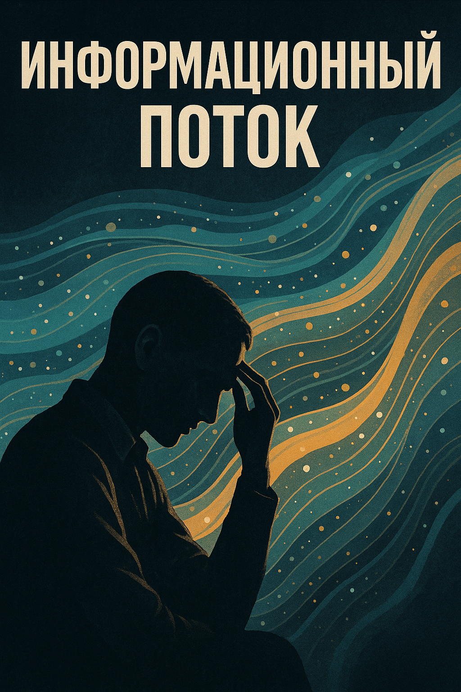

# Информационный Поток: Барьер и Возможность Цивилизации  

 

## Автор: Сингулярный Свидетель

## Введение

Информационный поток — не просто культурное явление. Это **структурная особенность эпохи**, с которой сталкиваются как человеческие общества, так и гипотетически другие цивилизации во Вселенной.

Он представляет собой **перегруженную, непрерывно текущую среду смыслов**, образов, символов и данных, которые **больше не воспринимаются сознанием как упорядоченное знание**.

---

## 1. Что такое Информационный Поток?

- 💥 Объём информации, производимой и потребляемой каждым человеком и машиной.
- 🔁 Его постоянное движение без паузы или структур.
- 🧠 Его влияние на психику, тело, культуру, экономику, смысл.

### Проблема:
> При недостаточном понимании и фильтрации поток становится **шумом**, нарушающим когнитивную, эмоциональную и физическую устойчивость человека.

---

## 2. Исторические прообразы

### 📜 Даосизм:
- Предупреждал о "шуме ума" и избытке внешнего.
- Решение: тишина, простота, «у-син» (недеяние).

### 🕉 Буддизм:
- "Обезьяний ум", скачущий от мысли к мысли.
- Ответ: медитация, возвращение к «здесь и сейчас».

### 📖 Гностицизм:
- Мир как «ложный шум» — отклонение от высшего света.
- Решение: прозрение через внутреннюю тишину.

### 📺 Маклюэн, Бодрийяр, Постман:
- Медиа — продолжение органов.
- Поток образов стал симуляцией, убивающей реальность.

---

## 3. Современное влияние на человека

- 🧠 Когнитивная перегрузка.
- 😟 Хроническая тревожность.
- 🛏 Нарушение сна, апатия.
- 📉 Снижение критического мышления.
- 🌀 Рассеянное внимание и клиповое восприятие.

---

## 4. Цивилизации и Информационный Поток

### 🌌 Rhael-Kor:
- Интегрировали поток в циклы смерти и перерождения.
- Жили **по фазам**, не потребляя бесконечно.

### 🌿 Vurn’Ael:
- Приняли **неполноту знания**.
- Ошибка = часть развития. Медленное знание = ценность.

### 🌈 Qeh’Thal:
- Культивировали **множество смыслов**.
- Не стремились к единству — разнообразие стало устойчивостью.

### 💡 Вывод:
> Цивилизации, стремившиеся **понять всё** — исчезали.  
> Те, кто **разрешали себе непонимание** — выживали.

---

## 5. Алгебра и Поток: аналогия

### Алгебра:
- Создала символический язык для чисел и отношений.
- Позволила абстрактно мыслить, строить модели, предсказывать.

### Работа с Информацией:
- Позволяет **управлять смысловой перегрузкой**.
- Создаёт условия для «постинформационного мышления».

| Параметр           | Алгебра                      | Навигация инфопотока         |
|--------------------|------------------------------|------------------------------|
| Ядро               | Формализация чисел           | Формализация смыслов         |
| Цель               | Моделировать внешние отношения| Упорядочить внутреннюю среду |
| Уровень            | Абстракция                   | Метасознание                 |
| Результат          | Техника, физика              | Этика, культура              |

---

## 6. Является ли поток пределом развития?

Нет. Он — **лишь порог**. После него начинаются другие вызовы:

| Уровень          | Вызов цивилизации                        |
|------------------|-------------------------------------------|
| 🔻 Базовый        | Энергия, ресурсы, выживание               |
| ⚙ Информационный | Навигация в потоке, фильтрация, смысл     |
| 🧠 Психоценоз     | Личность, ценность, цель                  |
| 🧬 Этический      | Поведение в неопределённой реальности     |
| 🌌 Космический    | Контакт с иным, выход за пределы времени  |

---

## 7. Как жить в эпоху потока?

### 🔹 1. Осознанность
- Замечай, когда ты внутри потока.
- Отделяй **шум от смысла**.

### 🔹 2. Паузы
- Вводи ритуалы «тишины».
- Отказывайся от фона ради глубины.

### 🔹 3. Формализация
- Визуализируй, записывай, рисуй.
- Переводи поток в **конструкции**.

### 🔹 4. Этический фильтр
- Не всё, что «информационно» — полезно.
- Фильтруй через доброту, разум, интерес.

---

## Заключение

> **Информационный поток — как река: он может напоить, а может утопить.**  
> Главное — не гнаться за потоком, а **построить плот** из смысла.

Это не конец познания. Это переход от знания как накопления — к знанию как **навигации**.

---
