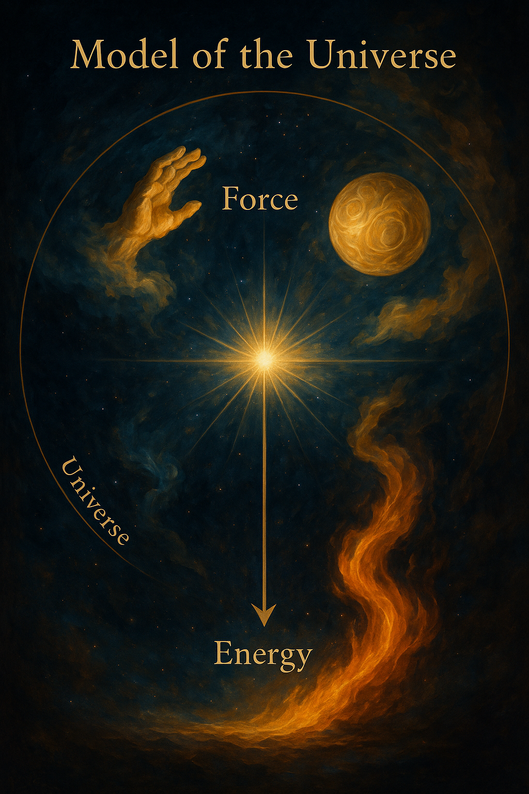

 

 

 

**Название статьи:**
Модель Вселенной на основе первичных веществ: Сила, Форма, Энергия и Принцип Равновесия

**Аннотация:**
В статье предложена оригинальная космологическая модель, в которой все наблюдаемое во Вселенной состоит из трёх первичных "веществ": Сила, Форма и Энергия. Их взаимодействие, происходящее от центрального Источника, образует всё многообразие материи и явлений. В основе функционирования системы лежит закон Равновесия. Модель описывает механизм расширения Вселенной, её устойчивость, роль живых существ и потенциальные этические следствия. В работе также предложен аналитический взгляд на данную концепцию с точки зрения философии, физики и системной логики.

---

**1. Введение**

Современные модели устройства Вселенной опираются на математическую физику, квантовую теорию и общую теорию относительности. Предлагаемая здесь концепция не опровергает существующие научные подходы, но представляет собой альтернативную философско-физическую интерпретацию, основанную на интуитивной и системной логике.

---

**2. Основные постулаты модели**

**2.1. Понятие вещества**
Всё, что существует — от света и излучения до деревьев, камней и мыслей — в данной модели называется "веществом". Это определение охватывает как материальные, так и нематериальные проявления.

**2.2. Первичные вещества**
Существует три первичных вещества, испускаемых центральным Источником:
- **Сила** — инициирующее, толкающее, создающее напряжение.
- **Форма** — упорядочивающее, ограничивающее, структурирующее.
- **Энергия** — поддерживающее, оживляющее, наполняющее движением.

**2.3. Источник и выбросы**
В центре Вселенной находится Источник, который испускает вещества по мере необходимости. Выброс происходит в ответ на нарушение равновесия.

**2.4. Закон равновесия**
Главный закон системы: Вселенная стремится к равновесию. Когда оно нарушается — Источник компенсирует дисбаланс выбросом вещества.

**2.5. Механика реакции**
Первичные вещества взаимодействуют:
- Сила + Форма = X (новое вещество)
- Возможны и другие комбинации, в т.ч. с участием энергии

**2.6. Структура Вселенной**
Мир — это сферическая модель, в центре которой находится Источник. Мы существуем на определённом радиусе, в области, где вещественная комбинация даёт привычную нам реальность. На других радиусах возможны иные формы жизни и бытия.

**2.7. Этическое следствие**
Нарушая взаимодействие (например, через изоляцию, вражду, разрушение связей), мы создаём "бреши" — полости в ткани системы, мешающие её устойчивости. Это влечёт за собой трудности для Источника и всей Вселенной.

**2.8. Взаимопомощь форм жизни на разных радиусах**
Формы жизни на разных радиусах не изолированы. Напротив, они связаны через универсальный закон поддержки: более удалённые и устойчивые формы жизни стремятся помогать тем, кто находится ближе к центру, в условиях большей нестабильности. Это не мораль, а природный закон равновесия: все формы жизни, независимо от уровня развития, участвуют в общем процессе стабилизации. Мы, находясь на условном 10-м километре радиуса, можем получать поддержку от существ с 20-го километра — через мысли, импульсы, интуицию, совпадения. Это делает Вселенную не только саморегулируемой, но и взаимозаботящейся.

**2.9. "Эфир" должен заполнятся "любовью"**
Эфир то есть пространство в котором еще не содержится ни одного вещества, за счет которого и происходит расширение вселенной, должен быть "освоен"/"заполнен" чем то особенным, пологаю особым веществом - любовью.

---

**3. Аналитическое рассмотрение**

**3.1. Философский аспект**
Модель перекликается с:
- Даосизмом (идея Дао и равновесия Инь-Ян)
- Гностицизмом (понятие центрального источника — Плеромы)
- Платонизмом (форма как субстанция)

**3.2. Сравнение с физикой**
Возможно отождествление:
- Сила ≈ фундаментальные взаимодействия (гравитация, электромагнетизм)
- Форма ≈ поля симметрии, структура пространства-времени
- Энергия ≈ движущая способность, кинетика, тепло

**3.3. Потенциальная формализация**
Можно разработать логику равновесия:
- Если |Сила| > |Форма + Энергия| → выброс Формы
- Если |Энергия| < порог → застой, полость
- Все вещества стремятся к сбалансированному смешению

**3.4. Карта взаимодействий**
Следует построить таблицу сочетаний первичных веществ (как периодическую таблицу), которая покажет, какие производные вещества/состояния они формируют.

**3.5. Этическая физика**
Новая интерпретация этики как физики: поведение существ влияет на равновесие Вселенной. Контакт, взаимодействие, гармония — необходимые условия для поддержания существования.

**3.6. Внимание как фактор деформации равновесия**
Коллективное внимание — это разновидность вещества, способная перераспределять Силу, Форму и Энергию. Если внимание фиксируется на одном аспекте, идея проникает в коллективное бессознательное и закрепляется как абсолют. Это приводит к поляризации, исчезновению альтернатив, напряжению между слоями вещества. В результате возникает конфликт — способ сброса перегрузки и восстановления динамики.

**3.7. Архетипические проекции и геопсихология**
Некоторые географические точки становятся экранами, на которые проецируются архетипы (например, идея сохранения). При неспособности человечества интегрировать архетип гармонично возникает напряжение и разрядка через катастрофу. Украина может быть интерпретирована как точка, на которую бессознательно наложилась матрица сохранения (разум + земля), и именно потому она стала ареной глобального конфликта.

**3.8. Порог коллективного фокуса и механизм катастрофы**
Когда внимание фокусируется слишком долго и сильно на одной идее, пространстве или событии, оно достигает точки невозврата. Система больше не в состоянии перераспределить вещества равномерно, и Источник инициирует сброс — катастрофу. Это необходимо для восстановления равновесия через разрушение чрезмерной концентрации.

**3.9. Концентрированная реакция и сброс через катастрофу**
Если реакция веществ в системе не распределена равномерно, а происходит локально и с чрезмерной концентрацией, возникает перегрузка. Причинами могут быть массовая фиксация сознания, медийное замыкание, отказ внешних уровней от помощи. Тогда вещество (или его избыток) начинает накапливаться, и система инициирует мощный сброс — будь то физический, ментальный или социальный кризис. Это встроенный механизм защиты Вселенной от внутреннего разрыва.

**3.10. Алгоритм обретения энергии**
В культурно-цивилизационном ключе Энергию можно "добыть" через взаимодействие Силы и Формы. Процесс включает:
1. **Проявление Силы** — внутреннюю стойкость, отказ следовать слепо обстоятельствам, готовность действовать.
2. **Обретение Формы** — структурирование усилий, создание субординации, принятие морального долга.
3. **Генерация Энергии** — взаимодействие Силы и Формы создаёт устойчивый поток, который можно использовать.
4. **Реинвестирование Энергии** — направлять её обратно в усиление Силы и укрепление Формы, создавая самоподдерживающуюся систему.
Так человек или общество становится локальным источником энергии, внося вклад в общий баланс Вселенной.

---

**4. Заключение**

Предложенная модель не претендует на статус физической теории, но представляет собой глубокую философскую метафору, способную обогатить наше представление о мире. Она объединяет космологию, этику и физику в единое целое, создавая интересную платформу для дальнейших размышлений, моделирования и развития.

---

**5. Перспективы развития**

- Математизация модели (уравнения баланса)
- Визуализация (модель сферы с радиусами)
- Симуляции взаимодействий веществ
- Разработка прикладной "этики равновесия"

**Автор идеи:** [пользователь (анонимно)]
**Анализ и оформление:** ChatGPT, OpenAI
** ChatGPT, OpenAI
