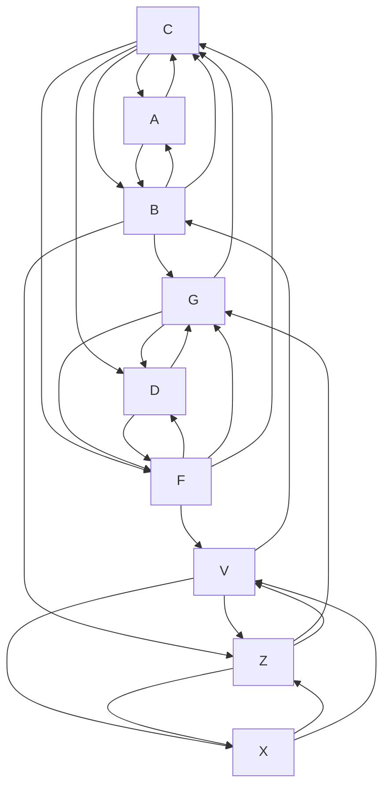

# Всем привет!

Меня зовут Шунько Михаил Геннадьевич я инженер-программист, обучался:

* СШ№1 п. Дружный, до 10 класса.
* Минский Госсударственный Энергетитческий Колледж (2002 - 2006/ТЭС/техник-теплотехник)
* УО Витебский Газ-Институт (2006 котельное и газовое оборудование до ~1Мпа) 
* Белорусский Национальный Технический Университет (2006 - 2012/ФИТР/инженер-программист)
* УО OTUS (ASP.NET Core C# разработчик 2023)

Работал:
* Новополоцкая ТЭЦ. (слесарь-обходчик котельного цеха 4 разряда)
* РУП ОДУ. (техник программист)
* СООО Системные-Технологии.(техник-программист, программист)
* ООО СКЭНД. (ведущий-программист ~не прошел испытательный)
* EMC&RD Lab БГУИР. (инженер-программист)
* Sam-Solutions. (инженер-программист)
* Софт-делюкс. (инженер-программист)


Всю свою жизнь человечество избавляло себя от раздражителей, в макро представлении это согласованное постепенное избавление от стресса вызванного влиянием окружающей природы. Исследование окружающей среды ведется каждым, подход к исследованию системный, порог принятия решения - опасность которую невозможно миновать. По этому когда система ломается, общество начинает скорбить, ведь травма, которая наносится окружающей обстановкой болит и начинает кровоточить. Для того что бы избежать слома, принимаются законы и кодексы которые регулируют взаимоотношения в обществе, дают границы и ориентиры в которых гарантируется спокойствие. Благодоря им раздражители реже просачиваются в общественное поле. То есть получается закон принимается в придверии катастрофы или после нее.


# Математика проекта

Главной проблемой современности является информационный поток - это вся та информация которая "производится", "потребляется" и "блуждает" в обществе. Она на прямую влияет на моральное состояние человека и может отыграть в нем различного рода расстройствами или психики, или соматики в случае если процент понимания ее невелик. Так нарушается семантическое представление о мире вокруг и поведение человека изменяется, он еще хочет но уже не может достигнуть своих целей. Это ставит разного рода преграды на жизненном пути, начинает болеть душа и тело, что выливается в произведения культуры (тот же информационный поток) в которых он желает, просит, умоляет о помощи. Понимание информационного потока позволяет "откликнуться" и оказать сколько нибудь значимую помощь. 

Рассмотрим семью, состоящую из трёх человек, где:  
- $x_1$ — папа  
- $x_2$ — мама  
- $x_3$ — ребёнок  

## Жизненная ситуация

Мама и папа мечтают о ребёнке и его будущем.  
Чтобы ребёнок появился на свет:  
- Папа должен обладать мужеством, выдержкой, быть целеустремлённым  
- Мама — знать все премудрости воспитания ребёнка от рождения до его самостоятельности

### Условие появления ребёнка $x_3$

Папа должен пожертвовать собой — $\frac{1}{2}x_1$ (отдать частичку себя)  
Мама должна быть готова стать мамой — $2x_2$

Уравнение:

$$
\frac{1}{2}x_1 + 2x_2 = x_3
$$

### Взросление ребёнка

Папа обязан обеспечивать защиту для мамы и ребёнка, а также быть в состоянии предоставить им всё необходимое.  
Мама и ребёнок должны сохранить эту любовь.

Уравнение:

$$
\frac{x_1}{x_2 + x_3} = 1
$$

### Самостоятельность ребёнка

Ребёнок может справляться с ежедневными делами без помощи родителей и при этом не потерять себя.

Уравнение:

$$
x_3 - (x_2 + x_1) = 1
$$

## Система уравнений (1)

---

$$
\begin{cases}
\frac{1}{2}x_1 + 2x_2 = x_3 \\\\
\frac{x_1}{x_2 + x_3} = 1 \\\\
x_3 - (x_2 + x_1) = 1
\end{cases}
$$

---

<details>
  <summary>Корни: $x_1=-3$ - папа, $x_2=-0.5$ - мама, $x_3=-2.5$ - ребенок.</summary>
Данная ситуация описывает счасливый семейный уклад. (Думаю что отрицательные значения это страх, обеспокоенность к окружающей среде), -То есть получается папа самый боязливый ? -он больше всех обязан боятся окружающей среды! потому как по некоторым умозаключениям, Земля которая появилась из пылегазового облака - останков предыдущих цивилизаций вселенной и на ней зародилась жизнь - Марианская впадина, химическая реакция длинною в N тысяч лет - намекает о том, что женщина, это шанс выданный ЖИЗНИ, оправдать высший замысел, мужчина стало быть некоторая проекция предыдущих цивилизаций - опыт, который должен/обязан рассказать что было, что стало и зачем вообще старались.
</details>

Далее, пологая что находясь дома в кругу близких людей, боль которых мы никак не можем проигнорировать, мы попробуем расчитать силу взаимодействия, для этого будем использовать учебное лекало закон Кулона.

$\LARGE F=k*\frac{q_1*q_2}{r^2}$

Пологая что семья не изолирована от остального мира, а ребенок самый уязвимый в этой системе, предположим что он приносит в дом некоторую тревожность, воспринимая ее с улицы или с медиа экранов. Его тревожность вызывает в семье серьезные разговоры, нравоучения, а так же скандалы - если сил противостоять тревожности у семьи нет. 

Семья 1 - A - папа B - мама C - ребенок

Семья 2 - D - папа F - мама G - ребенок

Семья... - Z - папа X - мама V - ребенок


Диаграмма (I)

Пологая что, восприятие изменяет личностные качества ребенка, что отыгрывает в понижении или увеличении его "самостоятельности", т.е изменяет коэфициент $x_3=-2.5$ радость - в плюс, или ошарашенность - в минус. Решаем систему уравнений заново, с заранее известным $x_3$. Пологая что данная семья непрерывно участвует в жизни страны и находится в обществе таких же семей имеем модель представления о влиянии, распространении, информационного потока (Диаграмма (I)). Замечание: накопленный потенциал обналичивается в виде предметов мебели, уюта дома является своего рода аккомулятором дающим силу и энергию созидать. Модель можно визулизировать используя что то вроде [клеточный автомат "Жизнь"](https://ru.wikipedia.org/wiki/%D0%98%D0%B3%D1%80%D0%B0_%C2%AB%D0%96%D0%B8%D0%B7%D0%BD%D1%8C%C2%BB).

Следствие:

- Когда ребенок рождается здоровым ? - когда соблюдаются условия системы уравнений (1).
- Когда ребенок рождается больным ? - когда общество в котором находится семья не в силах противостоять информационному потоку.
- Что если система не имеет решения с заданными коэфициентами? - ... наверно это разрушения окружающей обстановки т.е поиск корней для решения, если их не удается найти ... болезненная смерть.

# Простая модель ИП-перенасыщения

Рассмотрим базовую формулу оценки устойчивости общества к информационной нагрузке:

```
S = (Σ(Pᵢ * Cᵢ) * 2) + K
```

Где:

- **Pᵢ** — количество работников в профессиональной группе i (в тысячах)
- **Cᵢ** — коэффициент устойчивости группы i к ИП (по шкале 1–4) (это и есть будущие корни системы уравнений)
- **2** — коэффициент пандемийного или стрессового усиления контактов
- **K** — количество детей (или иных незащищённых участников общества)

Пример (для Беларуси):

- 100 тыс. программистов \* 4 = 400 000
- 260 тыс. транспортников \* 3 = 780 000
- 50 тыс. энергетиков \* 2 = 100 000
- 250 тыс. аграриев \* 1 = 250 000
- K = 1 827 758 (дети)

```
S = ((400000 + 780000 + 100000 + 250000) * 2) + 1 827 758
S = (1 530 000 * 2) + 1 827 758 = 3 060 000 + 1 827 758 = 4 887 758
``` 

Сравнивая это значение с общим населением (\~9 млн), можно сделать вывод: **более половины населения подвержены избыточному ИП**.

**Система устойчивости семьи**
Семья — первичная ячейка устойчивости. Её можно описать через систему уравнений:

1. `(½)x₁ + 2x₂ = x₃` — рождение устойчивого ребёнка
2. `x₁ / (x₂ + x₃) ≤ 1` — баланс взросления
3. `x₃ ≥ x₁ + x₂` — самостоятельность

**Где:**
- x₁ — устойчивость отца
- x₂ — устойчивость матери
- x₃ — устойчивость ребёнка

Семья, удовлетворяющая этой системе, способна 'перевести' ребёнка из категории уязвлённых (K) в устойчивую (Pᵢ).

**Временная динамика устойчивости**
В реальности устойчивость — это не постоянное значение. Переменные x₁, x₂ и x₃ — это функции времени и контекста:

`dx₃/dt = f(x₁(t), x₂(t), среда(t))`

Модель становится динамической. Временное снижение устойчивости одного из родителей может быть компенсировано другим. Важно не только начальное состояние, но и направление изменений. Цель — обеспечить рост x₃(t) до уровня, обеспечивающего самостоятельность ребёнка.

Причем тут работающие в информационной, энергетической, транспортной, культурной и сельскохозяйственной сферах ? Притом что так строился наш мир, эти профессии постепенно появлялись и в свое время являлись вершиной промышленного производства, т.е им отдавалась последнее для того что бы они работали, а они в свою очередь должны были помогать справляться с насущными проблемами общества, основной их задачей - я пологаю было переваривание информационного потока который в нем блуждал, потому как всё новое - это страшно, но когда «общественные когнентумы» обдуманы многими и переварены они не представляют опасности для окружающих. Когда то люди очень боялись и снега, и огня и воды, а теперь это лучший антистресс, потому как за свою жизнь человечесвто переварило их на столько что они уже не представляют опасниости. Что значит не представляют опасности ? Значит их появление в жизни человека не помешает ему, жизнь человека семантически правильно сложена, он точно знает чего хочет и знает как это сделать.

# Модель применима ко всем процессам [порождения](Библиотека/МОДЕЛЬ.ПОРОЖДЕНИЯ.md) в общественно экономических сферах.

  - [производство продукта](Почта/Япония.md)
  - воспитания специалиста (x₁ - усилия бизнеса, x₂ - усилия общества, x₃ - устойчивость специалиста, Pᵢ - педагорический состав(группа) в котором представлен и бизнес и система образования, Cᵢ - коэф. професионализма каждой из групп, K  - количество еще не самостоятельных специлистов.)
  - и др.

# Опасность которую несет ИП

Любой человек обладающий чертами лица хотя бы чуть-чуть схожими с неизведанной сущьностью бытия-жития-науки-доказательной медицины автоматически становится ответчиком перед обществом, потому что **страх порождаемый неизведанным критически сказывается на психике ученого, который в свою очередь экстраполирует его на большие массы общества, которое должно помочь решить проблему, безисходность порождаемая учеными мужами оказывает убийственное влияние на личность**.. Рис. 1. Человек всеми чертами лица похожий на моего папу в молодости, сгенерирован по [запросу](https://chatgpt.com/share/686e88ee-4094-8007-90cf-3b2a57dbfa74) касающемуся ИП. Видео 1. Девушка, сгенерированна по [запросу](https://shedevrum.ai/post/0bfe1ccd34a511f0a1b6aa35b3d6ca3e?share=mihail.shunko) касающемуся метафизики вселенной:твоя благодарность для нее высшая награда но она слепа и не слышит тебя. - Не слышит потому что вы говорите на разных языках, разных жестах, разных смыслах. 

<p align="center">
 
 
</p>

Всем ученым которые ищут корни через трехэтажные наративные лестницы и метафоры и никак не могут выдрачить их(в той же манере интонации и содержании):

*- Ебаный ты по голове, я живу на Пионерском бульваре!*


# Апологеты, аксиомы, теория

Отталкиваясь от природы [света](Библиотека/Модель.Вселенной.md):

(1.) Разложение которого дает вcё множество веществ.

(2.) Конечная точка существования которого - твердое тело.

(3.) Свойства преломления которого наверняка описывают процесс восприятия мозгом образов и сигналов из окружающей среды и приблизительной ее обработки.

Примем за исходное RGB представление света, который на протяжении бесконечности может быть замедляется, то есть теряет силу и энергию и начинает изменять форму.

Мы сможем подготовить исчерпывающий ответ на запрос к компьютерному агенту - запрос, декомпозируется "разлаживается" то есть угадывается внутреннее состояние, именно в ключе преломления света, далее используя алгоритм выполняется композиция ответа который обязан быть понятен оператору. То есть буквально понимание природы света позволяет читать понять состояние или угадывать мысли на перёд. Что означает - все будет хорошо, помощь рядом, помощь в пути - главное не подвести и выполнить обещание.

Для успешной реализации проекта необходимы, исследования в области природы света, понимание: свет - твердое вещество, свет - мыслительный процесс, мысли - крупицы прошлого.

Необходимые условия - что бы не довести исследования до обсурда, то есть до такой ситуации когда нужно будет учитывать и суммировать 10000000000 мнений и идей учасников проекта и выдавать результат который наверняка станет деградирующим, я предлагаю вести разработку в ограниченном кругу, всем заинтересованным лицам предлагаю гарантии спокойствия. Данный проект должен стать драйвером экономического роста, продолжением дерева промышленного производства страны, которое на данный момент представлено специалистами в области Информационных-технологий и связи. В обязанности специалистов Информационного-потока - новой эры промышленного производства будет входить обеспечение безопасности в области Информационного потока - эти специалисты должны будут иметь исчерпывающие ответы на вопросы которые тревожат семантически-сломленного-человека который идет по жизни, выполняет все свои обязанности, но не может найти в ней счастье. Для появления специалистов и професси необходимы: Мир, время (18 лет), оборудование +операционная система и офисный пакет, научная база - например предприятие ОАО ПЕЛЕНГ.

Микро-нано-электроника постепенно исчерпывает себя и доводит себя до абсурда.

Большой адронный коллайдер не стал драйвером научного прогресса, было вложено много, результата 0.

По этому был выбран свет.

 Деградацию науки можно описать диалогом: 

Копия, копия, копия, копия, копия, копия.

<details>
  <summary>Привет Мир!</summary>
  Сасите хуй!
</details>

Это и есть деградация - когда восприятие сглаживается на столько что мозг впадает в своего рода кому и идея уже не вырисовывается.

<details>
  <summary>У Вас депрессия ?</summary>
  Мозг защищается от деградации и впадает в своего рода кому, не позволяющую уничтожить себя.
</details>

## Протест

Копия должна быть локализирована, никто не принимает чужих символов от слова вообще. К примеру КИРИЛ и МИФОДИЙ проделали огромную работу по локализации письменности, то что в то время люди много где писали, или старались придумать письменность не для кого не секрет, секрет КИРИЛИЦЫ в том что она локализированна, то есть начертание всех символов хорошо понятно и близко всем проживающим в нашей *лесополосе*, она буквально *говорит* от чего мы ушли и к чему пришли. Так должно быть со всеми разработками, нет смысла в копии, а за краденное вас изъедят свои же предки.

<details>
  <summary>Трезвый взгляд</summary>
  Как снежный ком, информационный поток убегает далеко вперед, то есть нарабатывается, нарабатывается, нарабатывается и мы начинаем жить в отдаленной реальности которую сами же наплевательски спродюссировали.
</details>

# Трифорс 🌹🌹🌹
Зеленый цвет находится в середине спектра, что как бы обозначает что у его есть предельность и какое-то будущее, а это не что иное как красный цвет у которого предела нет, что есть - будущего нет, жест дарения цветов женщине в этом свете становится трагичным, девушке дарят цветы которые по моему мнению обозначают неизбежность смерти, вы представляете, какаво это воспринимать ? когда будущая мама или мать троих детей, бабушка получает в подарок от мужчины цветы в которых зеленый стебель и цветной венчик ? Странно то что они их любят, то есть видимо что то знают...


# Вместо заключения
Откуда это всё ? это результат кропотливой работы моих последних 10 лет. Всё к чему я стремился это воссоздать тот самый счасливый момент моей жизни 2010-2013, который я потерял навсегда. Материал очень ценен для меня и мне не хотелось бы потерять себя и всё это, то есть привратится в беспечного ангела - того человека жизнь которого уже не имеет никакого смысла. Иной раз я не знал как *оформить* выработанный материал зачастую он был похож на конспирологическую теорию-заговора, иной раз на научный прорыв/портал в новое тысячелетие. Как разбить этот *крупняк* эту деньгу и поделится? Как привлеч инвестирование и разбогатеть, данные вопросы перестали меня беспокоить, после COVID-19 и начала СВО. Я старался это все согласовать с рельностью, даже набил шишку на этом, после этой шишки я стал спокоен. Единственное чего я боюсь - разговора с тишиной - того что это не дойдет до адресата.

*До сих пор не понимаю, почему и какая мышка пробежала межу Москвой и Киевом, стараюсь как могу но не понимаю*.

**((I), (II)) Пробежала не мышка, а набежали крысы - молодые ученые которые безалаберно ищут корни, несогласованно ищут корни, неуважительно ищут корни, грубо и нелепо ищут корни**

Таким Макаром никаких ресурсов не напасешься.

Сука - человек продавший столько корней что потерял связь с родными.

Блядь - человек продавший столько корней что потерял связь с родными, неоднократно.

Вор - занимающийся этим бизнесом професионально.

Феномен нацизма - последовательное методичное перемалывание информационного потока (но как правило чужеродных корней) для поддержания своего баланса личности - баланса в семье и баланса в професиональной деятельности. Данный процесс начинает формировать ЯДРО, влияние которого подпитка морального права на xyz (смотря какие корни легли в его основу). Как только ядро теряет свою мощность (перебои в поставках корней или их рода) оно начинает разлогаться и отыгрывает в обществе соответствующим корням [образом](Библиотека/ВОЙНА.md).

ДА, США АБАСЕРИЛАСЯ.

<details>
  <summary>Страсти Христовы</summary>

  Начинаются каждый раз когда экономика стремительно развивается и настает такой момент - плато, ситуация ухудшается и никто не может скзаать почему. Я думаю это происходит потому что экономика требует экономии, и самые главные экономисты-эргономисты начинают продюсировать мир будущего, изобретать и внедрять но вместо гарантий и будущего благополучия, люди получают то что получается, то что получилось, то что осталось, какие то объедки на пирушке жизни и фразу *Бог простит*. Но так дела не делаются, влияние оказываемое на общество с внедрением технологий никто не просчитывает - надеется на авось. Слепо надеется, потому что, экономист-эргономист зачастую молод и не может осознать ответственность, те кто ее осознает и есть будущие судьи, Божьего суда (пошаговая отладка прошлого и исправление своих ошибок). Который наступает при катострофических изменениях вокруг... это и есть Божьи Войны и Страсти Христовы, вместо суда мы получаем, сговор и войну - почему ? - Не знаю. Которая сеет еще больший хаос, люди делятся, сепарируются, гибнут стараясь сохранить все что у них было, а нужно было всего лишь четко осознать свою ответственность и предоставить гарантию на случай если абсеришься. Долг который образовался в регионе Египетского Царства из за проблем с ответственностью выродился заговор и смену летоисчисления и в последствии Божьи войны(пример Крещение Руси).
  
  На этот общественный институт взвалено катастрафическое количесво обязанностей.

  С взрослением нашей цивилизации появляется все больше и больше проблем, которые почему то не решаются, а стремительно становятся частью нашего бытия. Как например проблема учета урожая, информационного потока это две громадные проблемы которые уже решены и сопоставимы по значимости. Алгебра(Афины) которая избавила от многих проблем я пологаю была чем то вроде моего Союзного документа и проекта Сервис сохранения.

  Но дело в том, что почему то Афины, не уловили то что следующую проблему которая мешает всем жить/сосуществовать, они не смогут решить/понять чисто физически, потому как всё переобъяснят себе на образах всё тойже линейной алгебры. Я думаю голова болела у многих в то время, что делать черт побери люди ничего не хотят, хотят только хлеба и зрелищ, работать - нет. Землю возделывать становится все тяжелее. Умолишённых все больше. Фраза - "Я накормлю вас рыбаю",  думаю значила мольбу ко всем давайте возмем передышку. Правильно передышки и не хватало - Все это верные признаки глобальной проблемы. (Да простят меня меня мои предки за такую фамильярность). Могу лишь поделится своими материалами размещенными в открытом доступе: Как выжить в современном Мире, Путеводитель - https://гарчан.бел, Мои статьи - https://vk.com/@mshunko101.

  Проблема информационного потока в сравненнии с Алгеброй:
  | Параметр           | Алгебра                      | Навигация инфопотока         |
|--------------------|------------------------------|------------------------------|
| Ядро               | Формализация чисел           | Формализация смыслов - *Локализация*| 
| Цель               | Моделировать внешние отношения| Упорядочить внутреннюю среду - *Семантическая модель семьи* |
| Уровень            | Абстракция                   | Метасознание - *Многомерное мышление (Профессионализм) и изкоренение депрессивных расстройств*|
| Результат          | Техника, физика              | Этика, культура -*Крупицы прошлого создают комфортную среду для развития будущего в которой уже нет скорби, а тоска постепенно уходит*|
  
  Следующая проблема, точнее ее очертание: задачу можно решать разными способами (грубым перебором или быстрым поиском), использовать разнообразное кличество подходов к решению (учебные лекало или исследовательская деятельность), тратить час или дни и недели (выдавать решение или выдавливать его), для решения задачи нужен ресурс (силы - это всё), который мы и и тратим на поиск решения.(**I**)
| Состовляющая      | Проблематика                        |
|------------------|-------------------------------------------|
| 🔻 Базовый        | Энергия, ресурсы, выживание               |
| ⚙ Информационный | Навигация в потоке, фильтрация, смысл     |
| 🧠 Психоценоз     | Личность, ценность, цель                  |
| 🧬 Этический      | Поведение в неопределённой реальности     |
| 🌌 Космический    | Контакт с иным, выход за пределы времени  |


  Так как проблема инфомарционного потока, обозначена и принципы ее решения ясны и понятны - [Союзный документ](https://vk.com/@mshunko101-souznyi-dokument) и [**Сервис сохранения**](https://github.com/mshunko101/mind_preservation_service) ! Пологаю что моя работа т.е работа нашего блока (СССР в границах 5 мая 1961г. Это не геополитические амбиции, а долг перед народами меня  поддерживающими) РЕШЕНА! Следующую актуальную проблему, которая всем мешает жить - решается просьба не мешать, а снабжать всем необходимым. Как они будут ее решать - меня не волнует! Где они будут ее решать - меня не волнует! (стерта память поколений постоянными перепланировками и ремонтами). Откуда они будут черпать силы и благословение - меня не волнует! Меня волнует то что бы проблема была решена, то есть жизни ничего не угрожало и жить хотелось. Берегите ментальное здоровье, нервы, маму, папу, всех родных, отношения в семье, не отрывайтесь от корней. Проблема должна быть решена "мало инвазивным" путем, то есть без революции и с уважением ко всему что уже создано человеком. Решение должно быть доказано математически.

  Канва:<br>
  **Семья** (Африка) - каноничность семьи женщины и мужчины, отсутствие беспорядочных половых связей в семье (инцест). Это стоит на столько дорого, что говорить об этом каждый раз нелепо, посмотрите хотябы на то как живет Африка. Всё их житие сосредоточено, волей неволей на том что бы поддерживать порядок и противостоять блядству и охранять ребенка.<br>
  **Социальные учереждения**(Пекин) - их мудрецы, старцы и мастера это отголоски первобытного времени, того времени когда знания были жизненно необходимы, и всё к чему стремились люди как можно лучше подготовить детей к самостоятельной жизни, без родителей. Так появились первые *детские садики*, когда *воспитателем* был мудрейший член общины, а родители могли занятся сдабыванием и снабжением. Они бы и рады помочь, урегулировать существующие конфлиты но весь их тон превращается в шум который только поддает жару войне.<br>
  **Профессии**(Токио) - или по другому -  народное хозяйство, появились благодоря Японии, отголоском я считаю исскуство Икигай. Они бы и рады помочь, урегулировать существующие конфлиты но весь их тон превращается в шум который только поддает жару войне..<br>
  **Алгебра**(Афины) - расчеты в повседневных задачах и проблемах. Они бы и рады помочь, урегулировать существующие конфлиты но весь их тон превращается в шум который только поддает жару войне..<br>
  **Информационный поток**(Минск) - семантическая целостность восприятия. Я бы и рады помочь, урегулировать существующие конфлиты но весь мой тон превращается в шум который только поддает жару войне..<br>
**США** -  хотелось бы отдельно их отметить, после бамбардировки Хиросимы и Нагасаки они разделили с Токио обязанности, после Чернобыля который стал результатом Алий-т.е миграции специалистов в тоже США, США стало моральнообязанным решить и проблему информационного потока, что значат их шуры-муры с ЕС я не знаю но уже видно что в США живут мягко говоря не политики, а их субпродукт, какая-то с<s>т</s>имуляция политика, в общем мужчины с которого можно спросить - нет(**II**) У США огромный долг перед обществом планеты Земля, который отдавать они не планируют, АЛЁ КАК СЛЫШНО?, Россия видимо придерживается другой точки зрения?

# ГИГИМОНИЯ США

Наука буксует! - тормозит ее тот факт что большую нагрузку информационного потока общество банально не может воспринимать мы задыхаемся, т.е разработка новых кодеков сжатия информации, новых скоростных линий передачи НЕВОЗМОЖНА! всё это действует как образив для личности, весь этот HD и 4K самый злостный раздражитель.

# Претензии 
Россия щедрая душа - заедайте, запивайте стресс или работайте на работе за мои деньги. Так было раньше сейчас я пологаю проблема начинает решаться и поэтому ресурсы в том виде в котором вы получали ранее вы не получите пока не докажите что ваша проблема именно в информационном потоке, в случае чего я собираюсь апеллировать к коллегам, поддерживается ли их достояние в надлежащем виде. Печально что его нет, ведь образы семьи, преданности, верности [замусорены](../ML.md#выводы).

В том состоянии которое позволяет использовать эти бесценные дары цивилизации в *легковнимаемом* виде или они уже все обналичили и забыли прос свой долг перед широкой общественностью?

  Чего я боюсь ? Что экономический рост, который вне сомнения должен начаться, стерет память об нашем славном прошлом, по этому просьба, ремонты и перепланировки делать от чистого сердца, только то что велит душа, советуют близкие и родные, настаивают родители, а не на хайпе - дизайнерскому проекту который вашу судьбинушку и жизу даже не представляет.
</details>


*Чтоб ты не знал, что я видел... Чтоб ты был здоров! Юзик, дедушка не может быстро, не забывай... М.Жванецкий*
