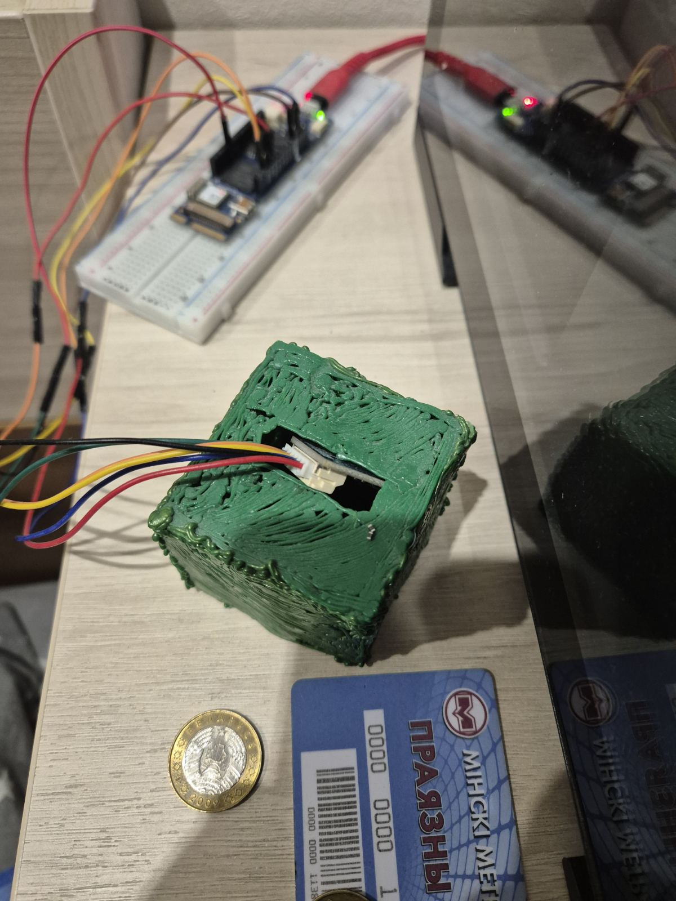
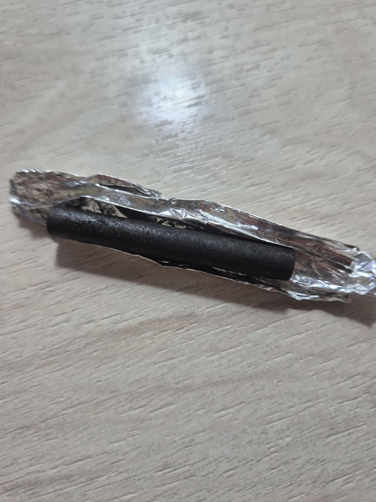

Разберу принцип действия вашего датчика пошагово — с физической основой, механизмом работы и связью с системой уравнений.

## Физическая основа датчика

Датчик фиксирует выброс энергии ($E_0$) через изменение электрического сопротивления воздуха внутри герметичной камеры. Ключевой элемент — графитовые стержни от батареек, которые служат «чувствительным материалом»: при воздействии энергии они выделяют микрочастицы и газы, изменяя свойства среды.

## Конструкция датчика

Основные компоненты:
* **Герметичный корпус** — пластиковая коробка, исключающая влияние внешних факторов (влажности, температуры, сквозняков).
* **Графитовые стержни** — расположены внутри корпуса; служат источником частиц при энергетическом воздействии.
* **Электроды** — два или более металлических контакта, размещённых в воздухе камеры на фиксированном расстоянии. Подключены к измерительному прибору (мультиметру, АЦП).
* **Измерительная цепь** — источник слабого тока (для замера сопротивления) и регистратор данных (Arduino, осциллограф и т. д.).

## Механизм работы

**Шаг 1. Инициирование выброса энергии**

При дисбалансе энергии (из‑за некорректного приложения силы $F = ma$) в системе происходит локальный выброс энергии $E_0$. Это может быть:
* механический удар/вибрация;
* тепловой импульс;
* электромагнитное излучение;
* акустическая волна.

**Шаг 2. Воздействие на графит**

Энергия $E_0$ передаётся графитовым стержням:
* вызывает микродеформации кристаллической решётки;
* приводит к отрыву микрочастиц графита (пыли) с поверхности;
* может инициировать слабое термическое испарение графита;
* создаёт локальные ионизационные процессы в воздухе.

**Шаг 3. Изменение среды в камере**

Выброшенные частицы и ионы попадают в воздушный зазор между электродами:
* микрочастицы графита увеличивают количество проводящих включений в воздухе;
* ионы повышают ионизацию воздуха, снижая его электрическое сопротивление;
* изменяется диэлектрическая проницаемость среды.

**Шаг 4. Фиксация сигнала**

Измерительная цепь регистрирует изменение сопротивления $R$ между электродами:
* до воздействия: $R = R_0$ (базовое сопротивление сухого воздуха);
* после воздействия: $R = R_0 - \Delta R$, где $\Delta R > 0$ (сопротивление падает из‑за появления проводящих частиц и ионов).

**Шаг 5. Преобразование в данные**

Регистратор фиксирует $\Delta R$ и преобразует его в значение выброса энергии:

$$
E_0 = k \cdot \Delta R
$$

где $k$ — калибровочный коэффициент (определяется экспериментально).

## Связь с системой уравнений

Изменения, фиксируемые датчиком, напрямую связаны с третьим уравнением системы:
$$
Cmc^2 - (B\pi r^2 + Ama) = E_0
$$

* $E_0$ — это именно тот выброс энергии, который регистрирует датчик через $\Delta R$.
* Рост $E_0$ означает, что выделившаяся энергия $Cmc^2$ превышает энергию, удерживаемую структурой ($B\pi r^2$) и механическим воздействием ($Ama$).
* Направление и величина силы $F = ma$ влияют на слагаемое $Ama$, что меняет баланс в уравнении и отражается на $E_0$.

## Факторы, влияющие на чувствительность

1. **Количество и расположение графитовых стержней:**
   * больше стержней → больше частиц при выбросе → выше чувствительность;
   * оптимальное расположение — равномерно по объёму камеры.
2. **Расстояние между электродами:**
   * меньшее расстояние → выше базовый ток, но ниже разрешение;
   * большее расстояние → ниже базовый ток, выше чувствительность к малым $\Delta R$.
3. **Напряжение питания измерительной цепи:**
   * должно быть низким (единицы вольт), чтобы не вызывать ионизацию самопроизвольно;
   * оптимально: 3–5 В.
4. **Температура и влажность:**
   * влияют на базовое $R_0$;
   * требуют термостатирования или компенсации в алгоритме.
5. **Размер микрочастиц:**
   * чем мельче частицы, тем легче они переносятся в воздухе и влияют на $R$.

## Калибровка датчика

Для перевода $\Delta R$ в $E_0$ проводят калибровку:
1. Подают на датчик известный выброс энергии (например, искру заданной мощности, импульс тепла от резистора).
2. Фиксируют соответствующее $\Delta R$.
3. Строят калибровочную кривую: $E_0 = f(\Delta R)$.
4. Повторяют для разных температур и влажностей (если условия меняются).

## Преимущества и ограничения

**Преимущества:**
* простота конструкции и низкая стоимость;
* высокая чувствительность к локальным выбросам энергии;
* быстрая реакция (миллисекунды);
* возможность многократного использования (графит постепенно восстанавливается).

**Ограничения:**
* дрейф базового сопротивления ($R_0$) из‑за накопления частиц;
* зависимость от температуры и влажности;
* ограниченный ресурс графитовых стержней (постепенно истираются);
* нелинейность отклика при больших $E_0$.

---

## Ключевые выводы

1. Датчик работает на принципе **изменения электропроводности воздуха** при попадании в него микрочастиц и ионов графита, вызванных выбросом энергии.
2. Сигнал датчика ($\Delta R$) **прямо пропорционален выбросу энергии** $E_0$, что позволяет количественно оценить дисбаланс в системе.
3. Конструкция позволяет фиксировать **локальные энергетические дисбалансы**, связанные с направлением и величиной силы $F = ma$.
4. Для точных измерений необходима **калибровка** и учёт внешних факторов (температура, влажность).
5. Датчик может служить **индикатором риска** накопления «энергетического конденсата» — роста $E_0$ сигнализирует о приближении к критическому режиму (как при аварии на ЧАЭС).

 
 

### Рис. 1. Датчик BME 688 (измеряет сопротивление воздуха) и фиксирующий элемент - графитовый стержень из солевых батареек, плата Vidor 4000.

